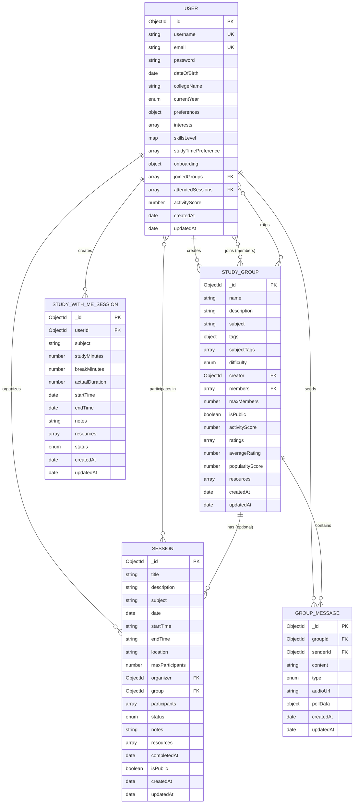

# EduConnect - Visual Entity Relationship Diagram

## ERD Diagram (Mermaid Format)



---

## Simplified Relationship Diagram

```
┌─────────────────────────────────────────────────────────────────┐
│                         USER                                     │
│  • _id (PK)                                                      │
│  • username, email, password                                     │
│  • preferences (interests, skillsLevel, studyTimePreference)     │
│  • joinedGroups[], attendedSessions[]                           │
│  • activityScore                                                 │
└──────────┬──────────────────────────────────────────────────────┘
           │
           │ creates (1:N)
           ├──────────────────────────────────────────┐
           │                                           │
           │ joins (M:N)                               │
           ├──────────────────────────────────────┐   │
           │                                       │   │
           │ organizes (1:N)                       │   │
           ├──────────────────────────────┐       │   │
           │                               │       │   │
           │ participates (M:N)            │       │   │
           ├──────────────────────┐       │       │   │
           │                       │       │       │   │
           │ sends (1:N)           │       │       │   │
           ├──────────────┐       │       │       │   │
           │               │       │       │       │   │
           │ creates (1:N) │       │       │       │   │
           ├──────┐       │       │       │       │   │
           │       │       │       │       │       │   │
           ▼       ▼       ▼       ▼       ▼       ▼   ▼
    ┌──────────┐  │  ┌─────────┐  │  ┌──────────────────────┐
    │  STUDY   │  │  │ SESSION │  │  │    STUDY_GROUP       │
    │  WITH ME │  │  │         │  │  │                      │
    │ SESSION  │  │  │ • _id   │  │  │ • _id (PK)          │
    │          │  │  │ • title │  │  │ • name              │
    │ • _id    │  │  │ • date  │  │  │ • description       │
    │ • userId │  │  │ • time  │  │  │ • subject           │
    │ • subject│  │  │ • org   │◄─┘  │ • tags              │
    │ • status │  │  │ • group │─────┤ • creator (FK)      │
    └──────────┘  │  │ • parts │     │ • members[] (FK)    │
                  │  └─────────┘     │ • activityScore     │
                  │                  │ • ratings[]         │
                  │                  └──────────┬───────────┘
                  │                             │
                  │                             │ contains (1:N)
                  │                             │
                  │                             ▼
                  │                  ┌──────────────────┐
                  └─────────────────►│  GROUP_MESSAGE   │
                                     │                  │
                                     │ • _id (PK)       │
                                     │ • groupId (FK)   │
                                     │ • senderId (FK)  │
                                     │ • content        │
                                     │ • type           │
                                     │ • pollData       │
                                     └──────────────────┘
```

---

## Cardinality Legend

```
Relationship Types:
├─ ||--o{ : One-to-Many (1:N)
├─ }o--o{ : Many-to-Many (M:N)
└─ ||--|| : One-to-One (1:1)

Symbols:
├─ || : Exactly one
├─ |o : Zero or one
├─ }o : Zero or many
└─ }| : One or many

Keys:
├─ PK : Primary Key
├─ FK : Foreign Key
└─ UK : Unique Key
```

---

## Relationship Details

### USER Relationships

1. **USER creates STUDY_GROUP** (1:N)
   - One user can create multiple study groups
   - Each study group has exactly one creator
   - Field: `StudyGroup.creator` → `User._id`

2. **USER joins STUDY_GROUP** (M:N)
   - Users can join multiple study groups
   - Study groups can have multiple members
   - Fields: `User.joinedGroups[]` ↔ `StudyGroup.members[]`

3. **USER organizes SESSION** (1:N)
   - One user can organize multiple sessions
   - Each session has exactly one organizer
   - Field: `Session.organizer` → `User._id`

4. **USER participates in SESSION** (M:N)
   - Users can participate in multiple sessions
   - Sessions can have multiple participants
   - Fields: `User.attendedSessions[]` ↔ `Session.participants[]`

5. **USER sends GROUP_MESSAGE** (1:N)
   - One user can send multiple messages
   - Each message has exactly one sender
   - Field: `GroupMessage.senderId` → `User._id`

6. **USER creates STUDY_WITH_ME_SESSION** (1:N)
   - One user can create multiple personal study sessions
   - Each study session belongs to exactly one user
   - Field: `StudyWithMeSession.userId` → `User._id`

7. **USER rates STUDY_GROUP** (M:N)
   - Users can rate multiple study groups
   - Study groups can be rated by multiple users
   - Field: `StudyGroup.ratings[].user` → `User._id`

### STUDY_GROUP Relationships

1. **STUDY_GROUP has SESSION** (1:N, Optional)
   - One study group can have multiple sessions
   - Each session optionally belongs to one study group
   - Field: `Session.group` → `StudyGroup._id`

2. **STUDY_GROUP contains GROUP_MESSAGE** (1:N)
   - One study group can have multiple messages
   - Each message belongs to exactly one study group
   - Field: `GroupMessage.groupId` → `StudyGroup._id`

---

## Data Access Patterns

### For Recommendations
```
1. Get User → Read preferences.interests[]
2. Get All Public Groups → Filter by isPublic: true
3. For Each Group:
   - Compare User.interests with Group.subjectTags (Content-based)
   - Find similar users in Group.members[] (Collaborative)
   - Calculate popularity from Group.activityScore (Popularity)
4. Combine scores and rank
```

### For Dashboard
```
1. Get User → Read joinedGroups[], attendedSessions[]
2. Get User's Groups → Query StudyGroup where _id in joinedGroups[]
3. Get User's Sessions → Query Session where _id in attendedSessions[]
4. Get Upcoming Sessions → Query Session where date > now
5. Get Recent Activity → Sort sessions by createdAt DESC
```

### For Group Chat
```
1. Get Group → Verify user in members[]
2. Get Messages → Query GroupMessage where groupId = group._id
3. Sort by createdAt DESC
4. Populate sender details from User
```

---

## Database Normalization

### 3NF (Third Normal Form) Compliance

✅ **First Normal Form (1NF)**
- All attributes contain atomic values
- No repeating groups (arrays are intentional for MongoDB)

✅ **Second Normal Form (2NF)**
- All non-key attributes fully depend on primary key
- No partial dependencies

✅ **Third Normal Form (3NF)**
- No transitive dependencies
- Calculated fields (averageRating, activityScore) are denormalized for performance

### Denormalization Decisions

1. **Activity Scores** - Stored directly for fast queries
2. **Average Ratings** - Calculated and stored to avoid aggregation
3. **Member Arrays** - Duplicated in User and StudyGroup for bidirectional access
4. **Embedded Resources** - Denormalized for atomic updates

---

## MongoDB-Specific Considerations

### Document Size Limits
- Maximum document size: 16MB
- Arrays (members, participants) monitored for growth
- Large content (messages, notes) have maxlength constraints

### Indexing Strategy
- Compound indexes for common query patterns
- Single-field indexes for foreign keys
- Text indexes for search functionality (future)

### Atomic Operations
- Embedded documents updated atomically
- Array operations use $push, $pull, $addToSet
- Transactions used for multi-document updates

---

## Future Enhancements

### Potential New Entities
1. **Notification** - User notifications
2. **Achievement** - Gamification badges
3. **Calendar** - Integrated calendar events
4. **File** - Uploaded file metadata
5. **Comment** - Comments on resources

### Potential Relationships
1. **USER follows USER** (M:N)
2. **USER bookmarks STUDY_GROUP** (M:N)
3. **USER subscribes to SESSION** (M:N)

---

Generated: 2024
Project: EduConnect Study Group Platform
